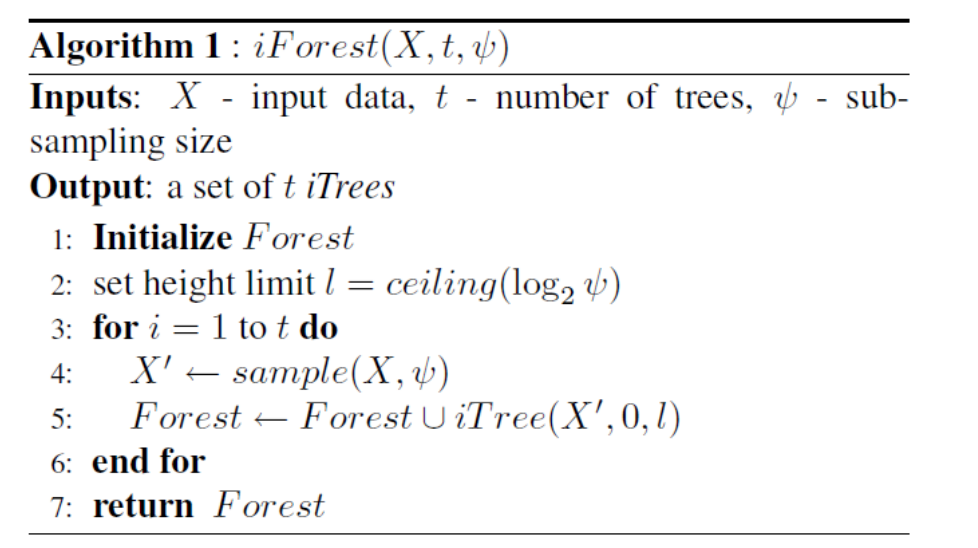
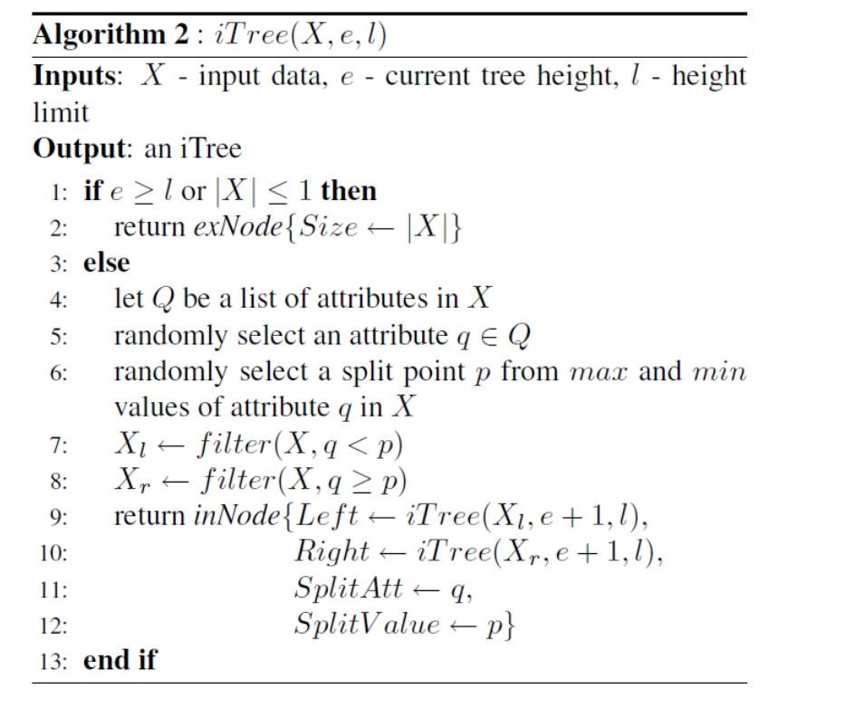
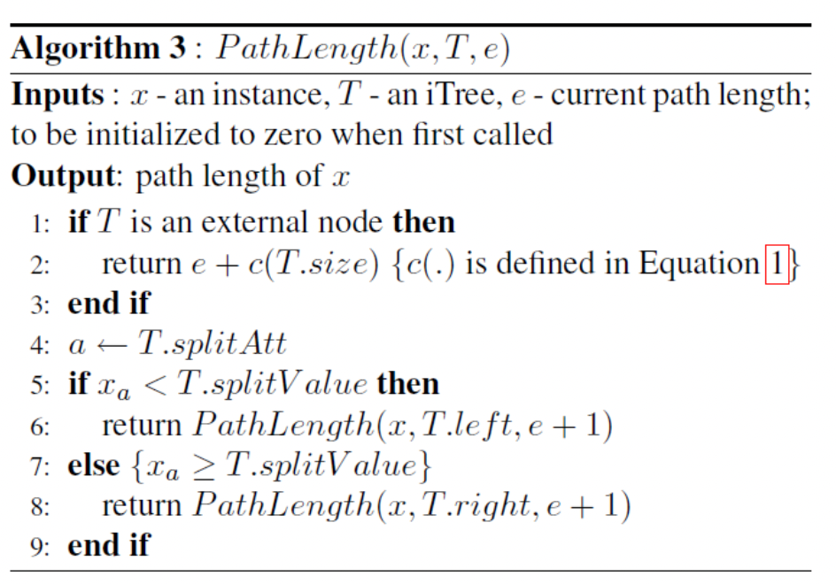
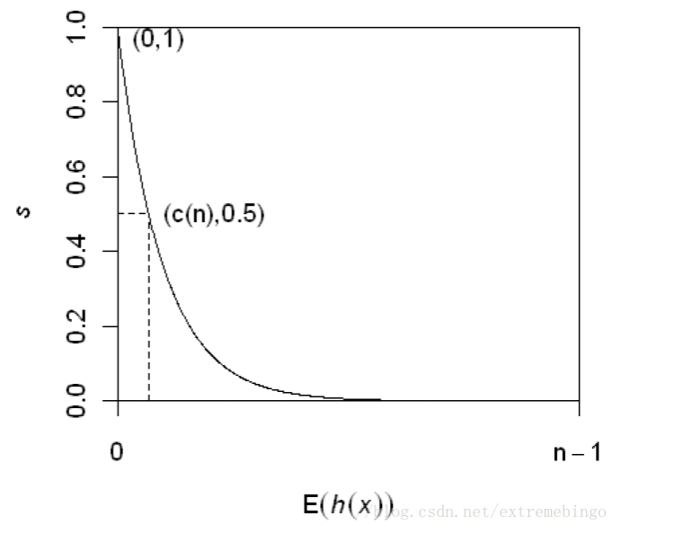

# anomaly_detection

*
ref：https://mp.weixin.qq.com/s?__biz=MzI4MDYzNzg4Mw==&mid=2247552622&idx=5&sn=8911513d9c1a1306da590bfd659b70f8&chksm=ebb736badcc0bfac43536a905ef999f29e5c618bb3bc41395a57b13b4306f8315055ccd08dc1&scene=27
* 是否需要标准化 以及 分类变量的处理：https://zhuanlan.zhihu.com/p/373562721

| 方法类别 | 方法名称 | 异常标准 |
| ---------- | ---------- | ---------- |
| 基于分布 | 3sigma   | 值>mu+3sigma/值<mu-3sigma         |
| 基于分布 | Z-score   |  z_score >3        |
| 基于分布 | boxplot   |  值>q3+1.5IQR或值<q1-1.5IQR        |
| 基于分布 | Grubbs假设检验   |  z-score>Grubbs临界值        |
| 基于距离 | KNN   | K近邻平均距离>阈值         |
| 基于密度 | LOF   | LOF>阈值        |
| 基于密度 | COF   | COF>阈值          |
| 基于密度 | SOS   | 异常概率>阈值         |
| 基于聚类 | DBSCAN   | 无法被聚类成簇(label=-1)         |
| 基于树  | iForest   | 异常得分>阈值         |
| 基于降维 | PCA   |   低维空间在所有方向上的偏离程度>阈值       |
| 基于降维 | AutoEncoder   | 重建样本和原始样本的误差>阈值         |
| 基于分类 | One-Class SVM  | 超平面外部的点(label=-1)         |
| 基于预测 | Moving Average、ARIMA等   | 预测值和真实值的残差+基于分布的方法         |

## LOF - 无监督

* 好处：可以量化每个数据点的异常程度
* 数据点p的局部相对密度(局部异常因子)为点p邻域内点点平均局部可达密度跟数据点p点局部可达密度点比值，即:
    * LOF_k(P)=\frac{\sum_{O\in N_k(P)\frac{lrd(O)}{lr(P)}}}{|N_k(P)|}
* 数据点P点局部可达密度=P最近邻点平均可达距离的倒数。距离越大，密度越小
* 点P到点O的第k可达距离=max(点O的k近邻距离，点P到点O点距离)

### 算法流程

* 对于每个数据点，计算它与其他所有点的距离，并按从近到远排序
* 对于每个数据点，找到它的KNN，计算LOF得分

### mythink

* 通过每个点每个特征的异常程度作为影响程度
* 分类变量需要encoding
* 数值变量标准化
* 离群的特征之一的score/离群的所有特征sum_score

## iForest

* 思想
    * 离群点应"少而不同"，即分布稀疏且离密度高的群体较远
    * 因此，随机构建的"二叉树"中，其离根节点较近（路径长度较小）
* 数据量较小时，更容易识别离群点
* 因此，使用子采样->提高识别准确度、计算效率

### 代码过程

* 孤立树Isolation Tree，简记为iTree：
    * 设T为孤立树的一个节点。T要么为叶节点，要么为根据1个检测条件分成2个分支(T_l，T_r)的中间节点。
    * 检测条件由变量q和临界值p组成，根据q<p是否成立，将T分为T_l和T_r
* iTree的外形与CART树等二叉树一致
* 但iTree属于无监督算法，分支方式不根据不纯度等指标，而是随机选择分支变量q并随机选择分支临界值p来构造
* iTree的停止条件(满足其中之一即可)
    * 树已达到要求的最大高度
    * 叶节点都只含有1个观测
    * 叶节点中的所有观测取值相同
* 对数据点的异常程度排序：**路径长度**，或 **异常分**
    * 路径长度：h(x)是从iTree的根节点到达数据点x所在的叶节点所经过的边的数量
        * 0<h(x)<=n-1
        * 多棵iTrees的h(x)的均值E(h(x))就可作为判断离群值的指标
            * E(h(x))越小的观测值，为离群值的可能性就越大
        * 缺点:E(h(x))受数据量n的影响，难以找到普适性的判断临界值
        * 记给定n时h(x)的均值为c(n),进行调整，从而得到标准化的异常分
    * 异常分
        * s(x,n)=2^(-E(h(x))/c(n))
        * c(n)=2H(n-1)-2(n-1)/n
        * H(i)为调和树,其估计值为ln(i)+0.5772156649
* 判断准则
    * s->1, 观测值->离群值
    * s<0.5, 观测值->不是离群值
    * 所有观测值的s≈0.5,所有观测值->不是离群值

### 伪代码

* 
* 
* 
* 

### 对离群值的处理

* 检查、寻因(离群值可能会提供关于数据问题的信息)
* 保留，使用稳健的数据预处理方法和模型
* 删除(要谨慎)
* 替换(如：分箱法，要谨慎)

### my_think

* 无监督
* -> 标注每条y是不是离群点，然后看出来孤立森林出来是不是离群点
* -> 如果对上的多的话，就是这个ok
* -> 根据树的原理得到判断为离群点的原因
